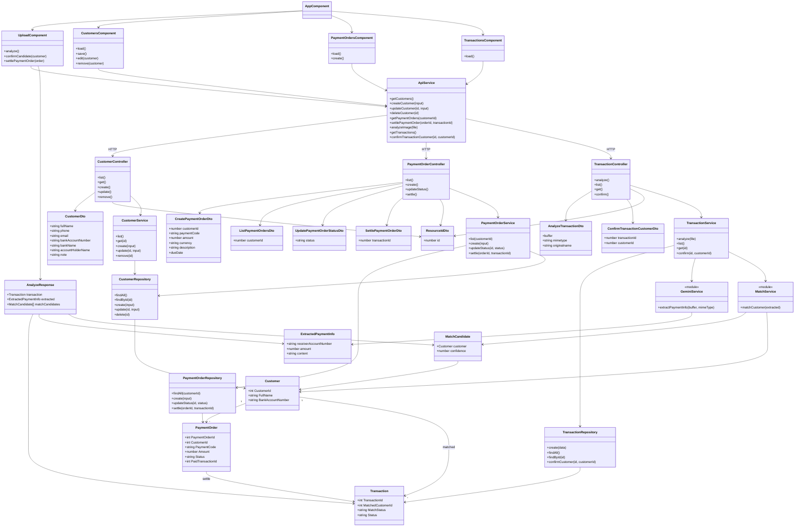

# Payment Matching AI

Ứng dụng Angular + Express.js + SQL Server + Gemini AI để đọc thông tin từ
ảnh giao dịch chuyển khoản, đối chiếu khách hàng và quản lý đơn thanh toán.

## Tính năng

- Tải ảnh giao dịch và trích xuất thông tin bằng Gemini AI.
- Lưu giao dịch vào SQL Server.
- Đối chiếu khách hàng theo số tài khoản và độ tương đồng tên.
- Quản lý khách hàng và thông tin tài khoản ngân hàng.
- Tạo đơn thanh toán với mã thanh toán do người dùng nhập.
- Tự động xác nhận đơn khi nội dung giao dịch chứa đúng mã thanh toán và số tiền giao dịch khớp số tiền đơn hàng.
- Cho phép xác nhận khách hàng và gắn giao dịch vào đơn thủ công.

## Kiến trúc

```text
Angular frontend
        |
        v
Express routes -> Controllers -> DTOs -> Services -> Repositories -> SQL Server
                                      |
                                      +-> Gemini AI / Match Service
```

- `backend/src/routes/`: khai báo endpoint.
- `backend/src/controllers/`: nhận HTTP request và trả HTTP response.
- `backend/src/dtos/`: chuẩn hóa dữ liệu giữa Controller và Service.
- `backend/src/services/`: xử lý nghiệp vụ, validation và gọi dịch vụ ngoài.
- `backend/src/repositories/`: truy vấn SQL Server.
- `frontend/src/app/core/`: model và API client.
- `frontend/src/app/features/`: các màn hình nghiệp vụ.

### Sơ đồ lớp



## Yêu cầu môi trường

- Node.js và npm.
- SQL Server đang chạy.
- Gemini API key.

## Cấu hình database

Repo hiện không chứa file `database/schema.sql`. Hãy tạo database và các bảng
`Customers`, `Transactions`, `PaymentOrders` theo môi trường SQL Server của bạn.

Bảng `PaymentOrders` phải có cột mã thanh toán. Nếu bảng đã tồn tại, chạy:

```sql
IF COL_LENGTH('dbo.PaymentOrders', 'PaymentCode') IS NULL
BEGIN
  ALTER TABLE dbo.PaymentOrders
    ADD PaymentCode NVARCHAR(100) NULL;
END;

IF NOT EXISTS (
  SELECT 1
  FROM sys.indexes
  WHERE name = 'UX_PaymentOrders_PaymentCode'
    AND object_id = OBJECT_ID('dbo.PaymentOrders')
)
BEGIN
  CREATE UNIQUE INDEX UX_PaymentOrders_PaymentCode
    ON dbo.PaymentOrders (PaymentCode)
    WHERE PaymentCode IS NOT NULL;
END;
```

## Cấu hình backend

```powershell
cd backend
npm install
Copy-Item .env.example .env
```

Mở `backend/.env` và điền thông tin SQL Server cùng Gemini API key:

```dotenv
PORT=3000
GEMINI_API_KEY=your_gemini_api_key_here
GEMINI_MODEL=gemini-2.0-flash
DB_USER=sa
DB_PASSWORD=your_password
DB_SERVER=localhost
DB_NAME=PaymentMatchingDB
DB_PORT=1433
DB_ENCRYPT=true
DB_TRUST_SERVER_CERTIFICATE=true
MATCH_THRESHOLD=70
```

Chạy backend:

```powershell
npm run dev
```

Backend mặc định lắng nghe tại `http://localhost:3000`.

## Cấu hình frontend

```powershell
cd frontend
npm install
npm run dev
```

Frontend Angular mặc định chạy tại `http://localhost:4200`. URL backend được
khai báo trong `frontend/src/app/core/services/api.service.ts`:

```ts
const API_BASE = 'http://localhost:3000/api';
```

Build production:

```powershell
npm run build
```

## API chính

### Transactions

| Method | Endpoint | Mô tả |
|---|---|---|
| `POST` | `/api/transactions/analyze` | Upload ảnh với field `file`, gọi Gemini, đối chiếu và lưu giao dịch |
| `GET` | `/api/transactions` | Lấy danh sách giao dịch |
| `GET` | `/api/transactions/:id` | Lấy chi tiết giao dịch |
| `PUT` | `/api/transactions/:id/confirm` | Xác nhận khách hàng với body `{ "customerId": 1 }` |

### Customers

| Method | Endpoint | Mô tả |
|---|---|---|
| `GET` | `/api/customers` | Lấy danh sách khách hàng |
| `GET` | `/api/customers/:id` | Lấy chi tiết khách hàng |
| `POST` | `/api/customers` | Tạo khách hàng |
| `PUT` | `/api/customers/:id` | Cập nhật khách hàng |
| `DELETE` | `/api/customers/:id` | Xóa khách hàng |

### Payment orders

| Method | Endpoint | Mô tả |
|---|---|---|
| `GET` | `/api/payment-orders?customerId=1` | Lấy đơn, có thể lọc theo khách hàng |
| `POST` | `/api/payment-orders` | Tạo đơn với `customerId`, `paymentCode`, `amount`, `currency` |
| `PATCH` | `/api/payment-orders/:id/status` | Cập nhật trạng thái đơn |
| `POST` | `/api/payment-orders/:id/settle` | Chuyển đơn sang `PAID` và gắn `transactionId` |

## Luồng tự động xác nhận thanh toán

Sau khi ảnh được phân tích và khách hàng được xác định:

1. Frontend tải các đơn `PENDING` của khách hàng.
2. Hệ thống kiểm tra `PaymentCode` có xuất hiện trong phần `content` của kết quả Gemini hay không.
3. Hệ thống so sánh `amount` của giao dịch với `Amount` của đơn hàng.
4. Nếu cả mã thanh toán và số tiền đều khớp, frontend gọi endpoint `settle`.
5. Backend cập nhật đơn thành `PAID` và lưu `PaidTransactionId`.
6. Giao diện hiển thị hộp thông báo xác nhận thành công.

## Logic đối chiếu khách hàng

Điểm đối chiếu nằm trong `backend/src/services/matchService.js`:

- Tối đa 70 điểm cho số tài khoản người chuyển trùng khớp.
- Tối đa 30 điểm cho độ tương đồng tên.
- Ngưỡng mặc định là `MATCH_THRESHOLD=70`.

Kết quả có thể là `MATCHED`, `NEEDS_REVIEW` hoặc `UNMATCHED`. Khi chưa chắc
chắn, người dùng có thể chọn khách hàng thủ công trên màn hình phân tích ảnh.

## Gemini AI

Prompt và phần gửi ảnh tới Gemini nằm trong:

`backend/src/services/geminiService.js`

Gemini được yêu cầu trả về JSON gồm ngân hàng, tài khoản, số tiền, mã giao
dịch, ngày giao dịch và nội dung chuyển khoản.

Có thể tạo Gemini API key tại:

https://aistudio.google.com/app/apikey

## Lưu ý bảo mật và triển khai

- Không commit `backend/.env`, API key hoặc mật khẩu SQL Server.
- Không commit `node_modules`, Angular cache và build output.
- Nên thêm xác thực và phân quyền trước khi triển khai production.
- Nên giới hạn rate limit cho endpoint phân tích ảnh vì mỗi lần gọi có thể phát sinh chi phí Gemini.
- CORS hiện được bật cho mục đích phát triển; cần giới hạn origin khi triển khai production.
- Ảnh giao dịch hiện được xử lý trong bộ nhớ; production nên dùng object storage nếu cần lưu lại ảnh gốc.
